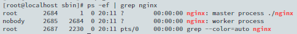
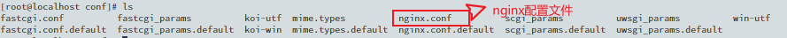
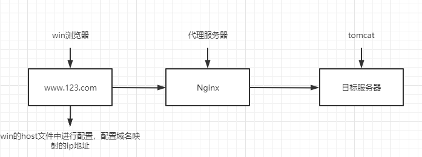
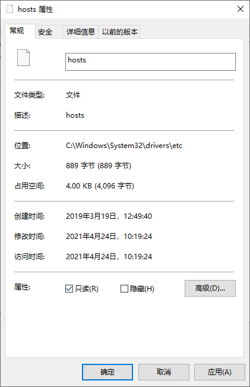
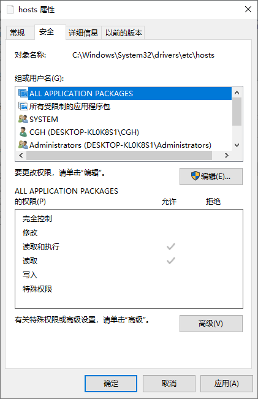
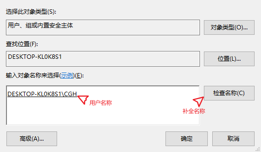
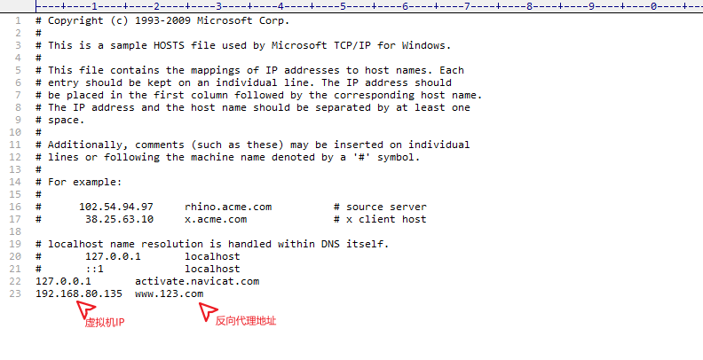
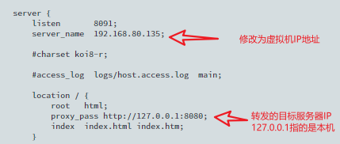
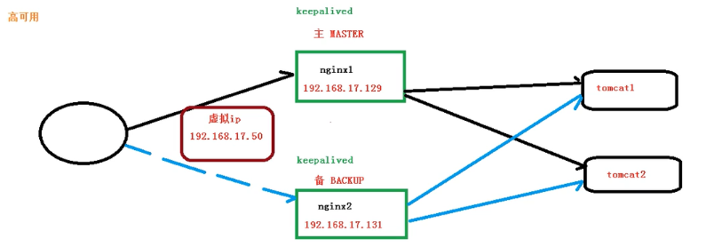
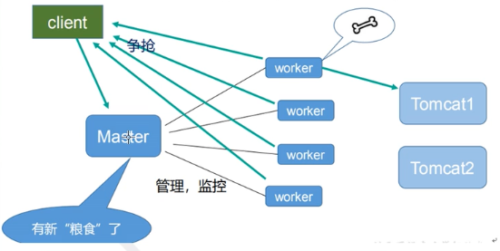

## Nginx 

## 1. nginx的安装与介绍

### Ⅰ  安装

> 1. 安装依赖
>
>    ```
>    yum -y install gcc zlib zlib-devel pcre-devel openssl openssl-devel
>    ```
>
> 2. 下载并解压
>
>    ```
>    // 创建存储压缩包文件的路径
>    cd /usr/local
>    mkdir nginx
>    cd nginx
>    // 到官网获取压缩包下载地址并使用wget下载
>    wget http://nginx.org/download/nginx-1.19.10.tar.gz
>    // 解压压缩包
>    tar -vzxf  nginx-1.19.10.tar.gz
>    ```
>
> 3. 安装nginx
>
>    ```
>    // 进入解压目录
>    cd /usr/local/nginx/nginx-1.19.10
>    // 执行命令 
>    ./configure
>    make
>    make install
>
>    ./configure
>    是用来检测你的安装平台的目标特征,并生成 Makefile
>    make
>    是用于编译的,从Makefile中读取指令,然后编译
>    make install 
>    用于安装,从Makefile中读取指令，安装到指定的位置
>    ```
>
> 4. 开放防火墙端口
>
>    ```
>    开启端口
>    firewall-cmd --zone=public --add-port=80/tcp --permanent
>    开放端口后需重启防火墙
>    systemctl reload firewalld
>    
>    命令含义：
>    –zone #作用域
>    –add-port=80/tcp #添加端口，格式为：端口/通讯协议
>    –permanent #永久生效，没有此参数重启后失效
>    ```
>

### Ⅱ  介绍

> 1. Nginx 是一个高性能的HTTP和反向代理服务器，特点是占有内存少，并发能力强，事实上nginx的并发能力确实在同类型的页面服务器中表现较好且Nginx专为优化而开发，可经受高负载的考验，支持热部署且可以做到数月内不重启，也可以做到不间断服务的情况下进行升级
> 2. 反向代理
>    1. 正向代理
>       - 客户端(浏览器)配置并通过代理服务器访问进行互联网访问
>    2. 反向代理
>       -  客户端(浏览器)将请求发送至反向代理服务器后，通过反向代理服务器向目标服务器请求，在整体请求过程中对外来说反向代理服务器与目标服务器是一个服务器，因此暴露的是代理服务器的IP地址而掩藏了真实服务器的IP地址
> 3. 负载均衡
>    -  通过反向代理服务器分发请求到各个服务器一并承担，而不是再由一个服务器全盘接收
> 4. 动静分离
>    - 通过反向代理服务器分发资源请求，首次请求时向静态资源服务器和动态资源服务器同时请求数据，接下来的所有请求将只请求动态资源

## 2. nginx 常用命令

### Ⅰ 使用nginx操作命令前应进入nginx目录下

```
cd /usr/local/nginx/sbin
```

### Ⅱ 查看nginx版本号

```
./nginx -v
```

### Ⅲ 启动nginx

```
./nginx
```

### Ⅳ 关闭nginx

```
./nginx -s stop
```

### Ⅴ 重载nginx配置文件

```
./nginx -s reload
```

### Ⅵ 查看nginx服务器状态

```
ps -ef | grep nginx
```

> 1. 服务器关闭状态
>    - 
> 2. 服务器开启状态
>    - 

## 3. nginx 配置文件

### Ⅰ 配置文件的位置

```
cd /usr/local/nginx/conf
```



### Ⅱ 配置文件的组成

- 进入配置文件

  - ```
    vi /usr/local/nginx/conf/nginx.conf
    ```

- 配置文件共有三部分组成

  - 全局块 从配置文件开始到events块之间的内容，主要设置一些影响nginx服务器的整体配置指令
  - events块 主要涉及Nginx服务器与用户的网络连接
  - http块 服务器配置中最频繁的部分包括 http 全局块，server块
    - http全局块 包含文件引入，MIME-TYPE 定义，日志自定义，连接超时时间，单链接请求数上限等
    - server块　与虚拟主机密切相关

## 4. nginx 实例配置 - 反向代理一

### Ⅰ 准备工作

1. 在Linux中安装tomcat，使用默认端口8080+

   - 进入存储文件的地址

     ```
     cd /usr/local/bin
     ```

   - 下载tomcat 

     ```
     wget 下载地址(https://mirrors.tuna.tsinghua.edu.cn/apache/tomcat/tomcat-10/v10.0.5/bin/apache-tomcat-10.0.5.tar.gz)
     ```

   - 解压

     ```
     tar -zvxf apache-tomcat-10.0.5.tar.gz 下载地址的版本号(apache-tomcat-10.0.5.tar.gz)
     ```

   - 进入tomcat

     ```
     cd /usr/local/bin/下载地址的版本号（apache-tomcat-10.0.5）
     ```

   - 启动tomcat

     ```
     /usr/local/bin/下载地址的版本号（apache-tomcat-10.0.5）/bin/startup.sh
     ```

   - 访问tomcat 通过IP地址+8080端口号
   
2. 服务过程分析

   - 由win浏览器访问目标服务器时，会先被代理服务器承接并进行转发到定义服务器，因此暴露的服务器的地址为代理服务器而非目标服务器



### Ⅱ 配置host文件

1. 找到win系统的host文件

   ```
   C:\Windows\System32\drivers\etc
   ```

2. 开启host文件的写入

   - 去掉只读权限

     

   - 编辑权限

     

   - 添加单用户读写权限

     

   - 输入单用户权限信息

     

   - 修改文件

     

   - 操作结束后勾上只读权限

### Ⅲ 修改nginx配置文件



### Ⅳ 通过访问182.168.80.135:8091端口去访问8080端口

## 5 nginx 实例配置 - 反向代理二

### Ⅰ 准备工作-配tomcat二号机

- 进入存储文件的地址(自定义)

  ```
  cd /usr/local/bin/(tomcat_1)[文件的存储位置]
  ```

- 下载tomcat 

  ```
  wget 下载地址(https://mirrors.tuna.tsinghua.edu.cn/apache/tomcat/tomcat-10/v10.0.5/bin/apache-tomcat-10.0.5.tar.gz)
  ```

- 解压

  ```
  tar -zvxf apache-tomcat-10.0.5.tar.gz 下载地址的版本号(apache-tomcat-10.0.5.tar.gz)
  ```

- 进入tomcat (地址自定义)

  ```
  cd /usr/local/bin/(tomcat_1/apache-tomcat-10.0.5)[文件的存储位置+版本号]
  ```

- 修改配置文件的端口号

  ```
  vi /usr/local/bin/(tomcat_1/apache-tomcat-10.0.5)[文件的存储位置+版本号]/conf/server.xml
  ```

- 修改端口为8081

  ```
  修改一：
  <!-- Note:  A "Server" is not itself a "Container", so you may not
       define subcomponents such as "Valves" at this level.
       Documentation at /docs/config/server.html
   -->
  <Server port="8015" shutdown="SHUTDOWN">
    <Listener className="org.apache.catalina.startup.VersionLoggerListener" />
    <!-- Security listener. Documentation at /docs/config/listeners.html
    <Listener className="org.apache.catalina.security.SecurityListener" />
    -->
    <!--APR library loader. Documentation at /docs/apr.html -->
    <Listener className="org.apache.catalina.core.AprLifecycleListener" SSLEngine="on" />
    <!-- Prevent memory leaks due to use of particular java/javax APIs-->
    <Listener className="org.apache.catalina.core.JreMemoryLeakPreventionListener" />
    <Listener className="org.apache.catalina.mbeans.GlobalResourcesLifecycleListener" />
    <Listener className="org.apache.catalina.core.ThreadLocalLeakPreventionListener" />
    
    
    
  修改二：
  <!-- A "Connector" represents an endpoint by which requests are received
           and responses are returned. Documentation at :
           HTTP Connector: /docs/config/http.html
           AJP  Connector: /docs/config/ajp.html
           Define a non-SSL/TLS HTTP/1.1 Connector on port 8080
      -->
      <Connector port="8081" protocol="HTTP/1.1"
                 connectionTimeout="20000"
                 redirectPort="8443" />
                 
                 
  修改三：
      <!-- Define an AJP 1.3 Connector on port 8009 -->
      <!--
      <Connector protocol="AJP/1.3"
                 address="::1"
                 port="8019"
                 redirectPort="8443" />
      -->
  ```

- 启动tomcat

  ```
  /usr/local/bin/(tomcat_1/apache-tomcat-10.0.5)[文件的存储位置+版本号]/bin/startup.sh
  ```

- 访问tomcat 通过IP地址+8081端口号

### Ⅱ 准备工作-配置/edu | /vod文件夹

- 进入web文件夹

  ```
  cd /usr/local/bin/(tomcat_1/apache-tomcat-10.0.5)[文件的存储位置+版本号]/webapps
  cd /usr/local/bin/apache-tomcat-10.0.5/webapps
  ```

- 创建文件夹

  ```
  /usr/local/bin/(tomcat_1/apache-tomcat-10.0.5)[文件的存储位置+版本号]/webapps
  mkdir vod
  /usr/local/bin/apache-tomcat-10.0.5/webapps
  mkdir edu
  ```

- 进入对应文件夹并创建测试页面a.html

  ```
  cd /usr/local/bin/(tomcat_1/apache-tomcat-10.0.5)[文件的存储位置+版本号]/webapps/vod
  touch a.html
  cd /usr/local/bin/apache-tomcat-10.0.5/webapps/edu
  touch a.html
  ```

- 编写a.html内容

  ```
  vi /usr/local/bin/[文件的存储位置+版本号]/webapps/文件夹名称/a.html
  ```

- 访问对应文件夹http://192.168.80.135:8080/edu/a.html / http://192.168.80.135:8081/vod/a.html

### Ⅲ 修改nginx配置文件

- 进入指定的目录下

  ```
  vi /usr/local/nginx/conf/nginx.conf
  ```

- 修改配置文件

  ```
   server {
          listen       8091;// nginx端口号白嫩重复
          server_name  192.168.80.135; // 名称
  
          location  ~/edu/  { // 监听端口
              proxy_pass http://127.0.0.1:8080;
          }
  
          location  ~/vod/ {
              proxy_pass http://127.0.0.1:8081;
          }
      }
  ```

- location指令说明

  - 用于匹配URL 语法格式为

    ```
    location [ = | ~ | ~* |^~] uri{}
    ```

    

### Ⅲ 访问 http: //192.168.80.135:8091/(edu|vod)/a.html


## 6. nginx实例配置 - 负载均衡

### Ⅰ 准备工作与反向代理二一致，但需为每个tomcat配置相同的/edu

### Ⅱ 配置nginx配置文件

```
upstream  myserver{//配置负载均衡
		ip_hash;
        server 192.168.80.135:8080 weight = X;
        server 192.168.80.135:8081;
        fair;
   }

   server {

        listen       8092;
        server_name  192.168.80.135;

        location /  .... {
            proxy_pass http://myserver;
        }
   }
```

### Ⅲ 负载均衡分配策略

1. 轮询
   - 请求按时间顺序逐一分配到不同的服务器，当服务器down机了会自动删除
2. weight 权重
   - 根据权重分配，权重等级越高分配越多
3. ip_hash
   - 每个请求按访问的IP的hash结果分配，每个IP固定一个服务器
4. fair 第三方
   - 根据响应时间分配，谁越快响应就分配给谁

## 7 nginx实例配置 - 动静分离

### Ⅰ准备工作

- 准备静态资源image(图片)和需访问的静态页面

### Ⅱ 配置nginx配置文件

```
server {
        listen  8093;
        server_name 192.168.80.135;

        location /www/{
           root /data/;
           index index.html index.htm;
        }
        location /image/{
           root /data/;
           autoindex on;
        }
    }
```

### Ⅲ 访问http:// 192.168.80.135:8093/image/a.jpg | http:// 192.168.80.135:8093/www/a.html

### Ⅳ 补充

- 如果出现访问403 Forbidden时需为访问的文件或图片添加权限，执行`chmod 777 需要权限的文件`(777分别代表User、Group、及Other的权限)
  - chmod后面的参数 对应二进制 
    - read 4  = 100
    - write 2  = 010
    - execut e 1=  001
    - 补齐用 0

## 8. nginx实例配置 - 高可用

### Ⅰ 配置配置两台nginx服务器按文档一进行安装

### Ⅱ 为两台nginx服务器配置Keepalived

- 通过官网获取安装包下载连接

  ```
  // 官网
  https://www.keepalived.org/download.html
  // 安装包链接
  https://www.keepalived.org/software/keepalived-2.2.2.tar.gz
  ```

- 下载并解压

  ```
  // 进入 /usr/local/src 目录下
  cd /usr/local/src
  // 下载文件
  wget https://www.keepalived.org/software/keepalived-2.2.2.tar.gz
  // 解压文件
  tar -vzxf keepalived-2.2.2.tar.gz
  ```

- 安装

  ```
  // 进入文件目录
  cd keepalived-2.2.2
  // 执行安装命令 --prefix(文件的安装地址)
  ./configure --prefix=/usr/local/keepalived
  make && make install
  ```

- 初始化

  ```
  // keepalived启动脚本变量引用文件，默认文件路径是/etc/sysconfig/，也可以不做软链接，直接修改启动脚本中文件路径即可（安装目录下）
  cp /usr/local/keepalived/etc/sysconfig/keepalived  /etc/sysconfig/keepalived 
  
  // 将keepalived主程序加入到环境变量（安装目录下）
  cp /usr/local/keepalived/sbin/keepalived /usr/sbin/keepalived
  
  // keepalived启动脚本（源码目录下），放到/etc/init.d/目录下就可以使用service命令便捷调用
  cp (解压时文件存储路径) [/usr/local/src/keepalived-2.2.2]/keepalived/etc/init.d/keepalived  /etc/init.d/keepalived
  
  // 将配置文件放到默认路径下
  mkdir /etc/keepalived
  cp /usr/local/keepalived/etc/keepalived/keepalived.conf /etc/keepalived/keepalived.conf
  ```

- 启动/关闭/重启

  ```
  service keepalived start|stop|restart
  ```
  
- 配置文件位置
  
  ```
  cd /etc/keepalived
  ```

  ### Ⅲ 配置keepalived

- 配置keepalived的配置文件

  ```
  //修改配置文件
  vi /etc/keepalived/keepalived.conf
  // 修改为以下内容
  # 全局配置
  global_defs {
      notification_email {
          acassen@firewall.loc
          failover@firewall.loc
          sysadmin@firewall.loc
      }
      notification_email_from Alexandre.Cassen@firewall.loc
      smtp_server 192.168.127.131 #这里修改为 MASTER IP
      smtp_connect_timeout 30
      router_id LVS_DEVEL # 当前主机 IP(在/etc/hosts文件中指的是IP的别名)
  }
  # 检测脚本配置
  vrrp_script chk_http_port {
      # 指定检测脚本位置
      script "/usr/local/nginx/nginx_check.sh"
      # 检测间隔(秒)
      interval 2
      # 修改权重
      weight 2
  }
  # 虚拟 IP 配置
  vrrp_instance VI_1 {
      state MASTER   # 主机这里是MASTER 从机是BACKUP
      interface ens33  # 网卡，可以通过 ifconfig 查看
      virtual_router_id 51  # 主、从机的virtual_router_id必须相同
      priority 100   # 主备机取不同的优先级，主机优先级大
      advert_int 1  # 心跳检测间隔时间
      authentication { # 权限校验方式
          auth_type PASS
          auth_pass 1111
      }
      virtual_ipaddress {
          192.168.127.50   # VRRP 虚拟IP ；可换行输入多个进行绑定
      }
  }
  ```

- 配置脚本文件

  ```
  #!/bin/bash
  A=`ps -C nginx -no-header |wc -l`
  if [$A -eq 0 ];then
      /usr/local/nginx/sbin/nginx
      sleep 2
      if [`ps -C nginx --no-header |wc -l` -eq 0 ];then
          killall keepalived
      fi
  fi
  ```

- 启动keepalived

  ```
  // 查询keepalived相关文件
  whereis keepalived.server
  // 进入sbin目录
  cd /usr/local/keepalived/sbin
  // 启动
  ./keepalived
  ```

### Ⅲ 高可用流程图



## 9. nginx 流程解析

1. 
   - 启动nginx时会出现master和worker两个进程，在进程中master为管理者有且只能有1个，worker为工作者有且可以有多个
2. 
   - master发布任务后，由worker去接收并执行，但这期间是由多个worker同时争抢的而非轮询
3. master和多个woker的好处
   - 可以使用nginx -s reload进行热部署，利用nginx进行热部署操作(工作的先不进行，闲置的先进行热部署后加入争抢队列，当工作的工作完再进行热部署后加入争抢队列)
   - 每个woker是独立的进程，互不干扰，因此实现了请求过程不会造成服务中断
4. worker的数量
   - 与CPU成正比
5. 连接数worker_connection
   - 发送请求占用几个worker的连接数
     - 2/4（当有静态资源服务器的时候为4）
   - nginx有一个master和4个worker，每个worker支持最大连接数1024，支持最大并发数
     - worker_connections(最大连接数)*worker_processes(worker的数量) / (2/4(当有静态资源服务器的时候为4))


